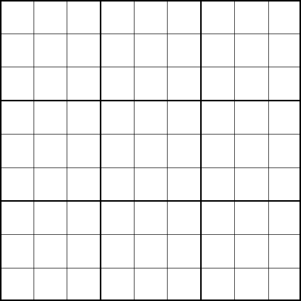
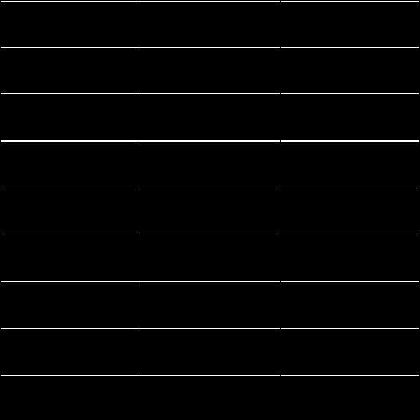
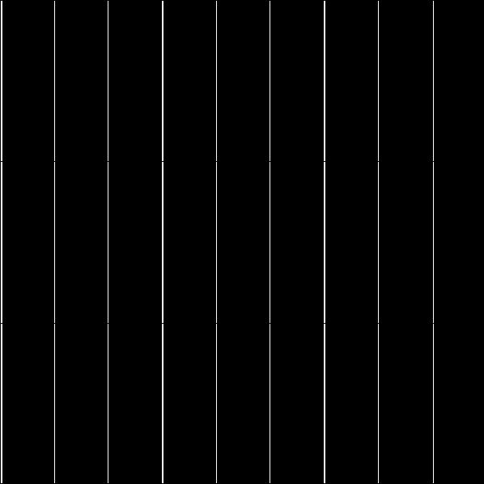
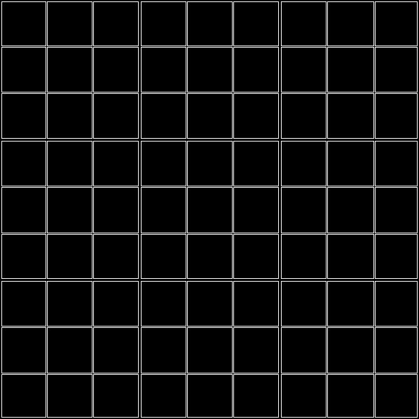

# Convolution is Evolution 😎
### This is to see how a kernel will convolve over image and what will be its output after convolution

#### Kernels that we are using:
- **Horizontal** kernel will extract all *horizontal* edges
- **Vertical** kernel will extract all *vertical* edges
- **Edge** kernel will extract all *edges*

#### Demo Image


#### Kernels with their output:
1. Horizontal Kernel

```python
np.array([
    [-1, -1, -1],
    [ 0,  0,  0],
    [ 1,  1,  1],
])
```



2. Vertical Kernel

```python
np.array([
    [-1,  0,  1],
    [-1,  0,  1],
    [-1,  0,  1],
])
```



3. Edge Kernel

```python
np.array([
    [-1, -1, -1],
    [-1,  8, -1],
    [-1, -1, -1],
])
```



#### UI
We have created UI for this demo using **[Streamlit](https://www.streamlit.io/)**

- `pip install streamlit`
- `streamlit run app.py`